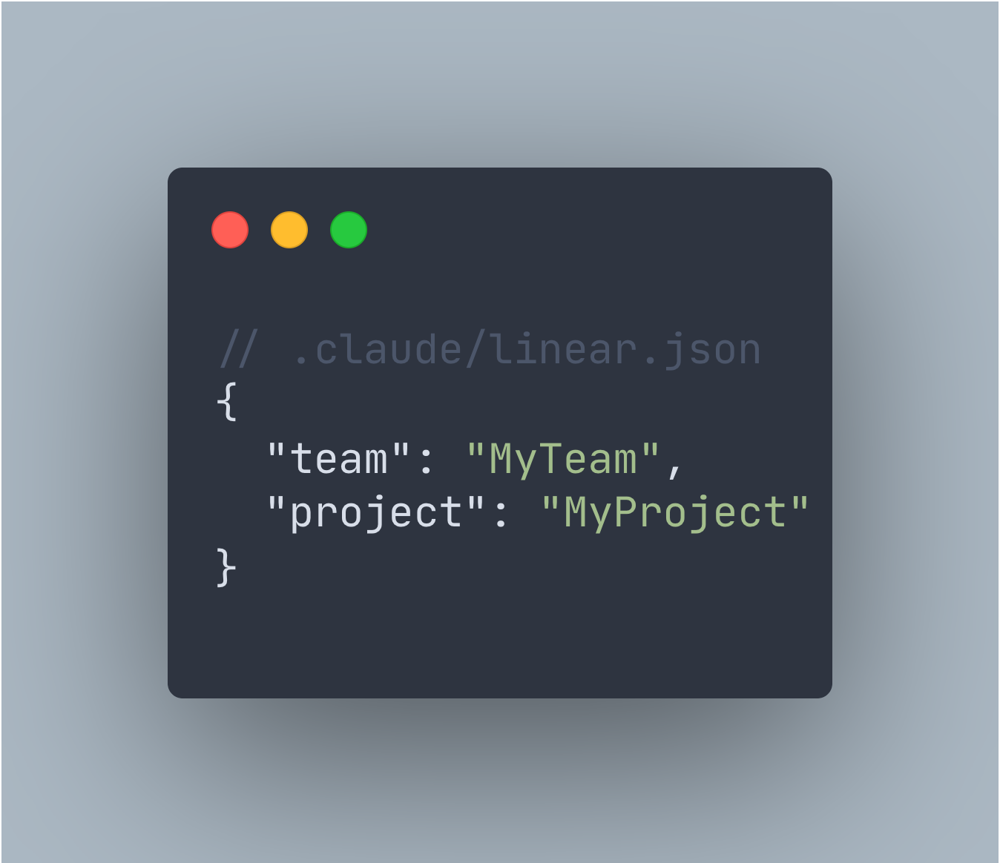
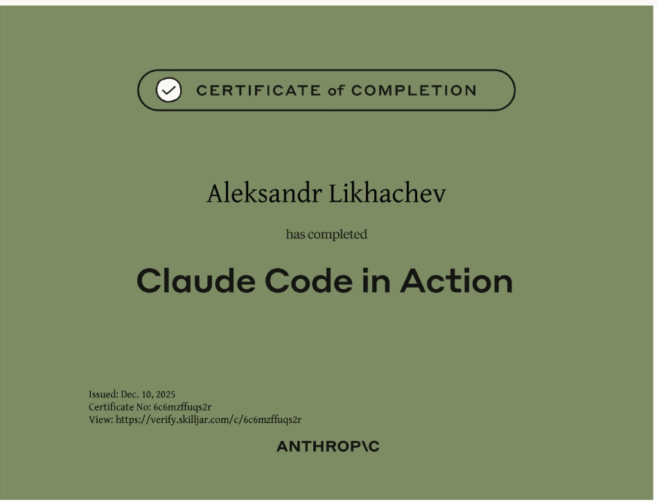
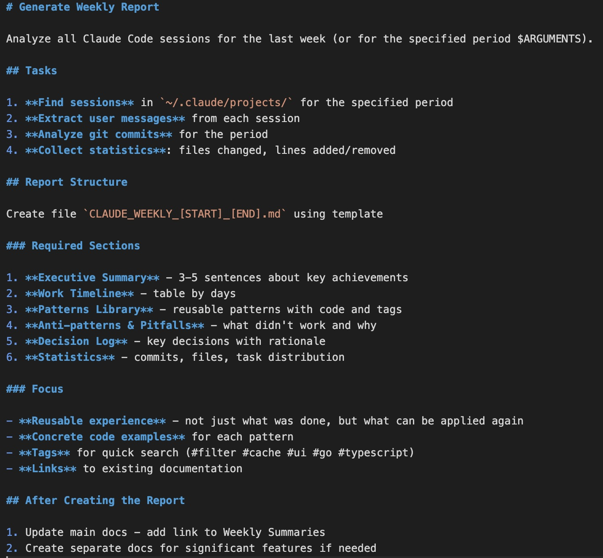

Having to write code yourself in 2025? Absolutely disgusting.

That's the energy Claude Code brought this week when they added `/output-style learning` mode. It leaves `TODO(human)` gaps in the code and makes you actually think. Which is ironic because the whole point of AI tooling is supposedly to think less. But here's the thing—it works. You learn the codebase by filling in the gaps instead of copy-pasting mysterious AI-generated blocks.

## Linear Integration That Actually Saves Time

Built a Claude + Linear integration that removes the most annoying part of my workflow: switching between Linear and terminal to manually start tasks.

Custom `/linear-tasks` command pulls all Todo issues from Linear and executes them automatically. Todo → In Progress → Testing, all hands-free. Just need a config file with your team and project names.



No more:

- Opening Linear in browser
- Copy-pasting issue descriptions
- Manually updating status
- Losing context mid-task

It's not revolutionary. Just removes friction. Turns out AI agents work better when they can actually see your task list instead of you describing it in a prompt.

## Course Notes: Claude Code in Action

Finished the Claude Code in Action course from Anthropic. Practical stuff, no fluff:

**Context management with CLAUDE.md files** — How to give Claude persistent knowledge about your project without repeating yourself in every prompt.

**MCP server integration** — Extending Claude's capabilities with custom tools. This is where it gets interesting.

**GitHub automation** — PR reviews that actually understand what your code does.

**Custom hooks and commands** — Building your own shortcuts for repetitive tasks.

The course is practical. Not "here's what AI might do someday" but "here's how to integrate it into your workflow today."



## Playwright + Frontend Design = Pair Programming

The Playwright MCP + Frontend Design plugin combination hit different.

The AI writes code, launches a browser, looks at what it built, and fixes things on its own. Feels less like prompting and more like pair programming with someone who actually sees your screen.

Setup takes 2 minutes:

```bash
claude mcp add playwright -- npx playwright/mcp@latest
claude install frontend-design
```

That's it. Then try something like:

> "Use frontend-design plugin. Build a pricing page with 3 tiers, dark theme, glassmorphism cards. Open in browser and adjust until it looks polished."

It'll iterate on the design without you manually describing every visual adjustment. The AI can _see_ the result and knows when something looks off. This is the kind of workflow that makes AI tools feel less like autocomplete and more like collaboration.

## Weekly Summaries: Remembering Why You Did This

Finally solved my "why did I do this??" problem.

Every Friday I run one command and Claude Code generates a summary of my week. One slash command analyzes:

- All coding sessions
- Git commits
- Files changed

Then outputs patterns found, mistakes made, decisions explained.



Last week it saved me from repeating the same bug I already fixed on Tuesday. I just forgot. Because of course I did. Human memory is terrible at tracking implementation details across dozens of files.

Not revolutionary. Just useful. The kind of thing that adds up over months.

You ship faster when you're not re-learning your own codebase every Monday.

## Session Renaming: Finally

Small update that [landed this week](https://www.threads.com/@claudeai/post/DSGBJL_ktA-?xmt=AQF0ZNg9gFLRvJauBFIt5kLSRXnC6ZpjKTJVN3hB2YJW1A): you can now rename Claude Code sessions.

Sounds trivial. It's not. When you're juggling multiple projects and resuming sessions later, "chat-7a3f" tells you nothing. Now you can name them properly. Finally.

## The Pattern

All these tools have something in common: they remove friction instead of adding complexity.

No dashboards to check. No new platforms to learn. No "AI-powered" buzzword soup. Just tools that fit into existing workflows and make them less annoying.

That's what good AI tooling looks like. Not replacing developers. Just handling the repetitive context-switching that burns mental energy for zero value.

The future isn't AI writing all your code. It's AI removing everything that keeps you from writing the interesting parts.

---

_Building Nordic tech from Kokkola, Finland._
