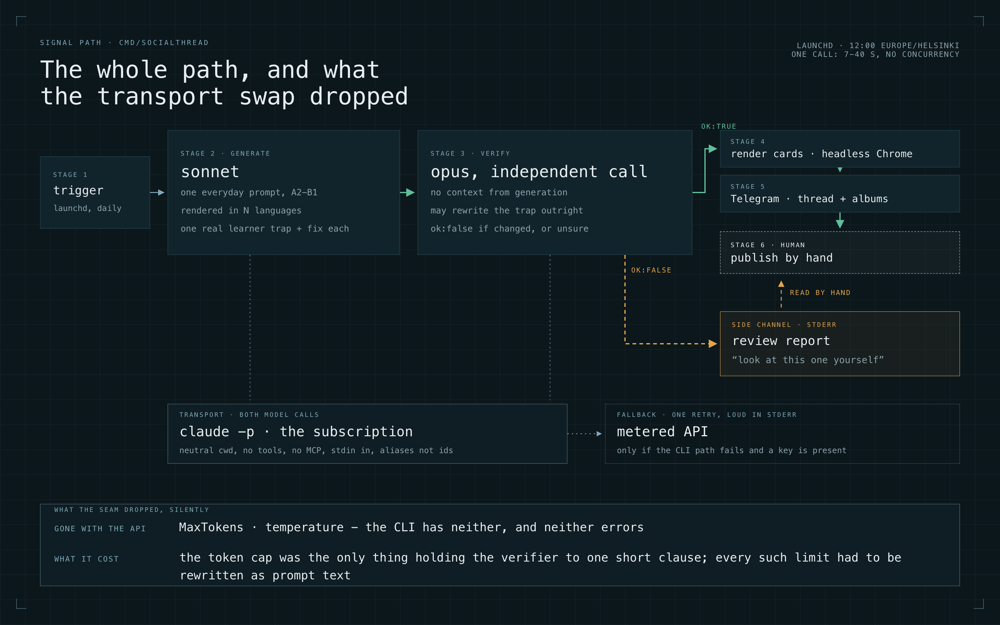

what decides which transport an LLM call gets is who is waiting for the answer. Everything else in this post follows from that one line.

The system is small and unglamorous: an ops utility in the mening repo, `cmd/socialthread`, that drafts one social post a day for a language-learning app. It runs on my machine, it talks to nobody's users, and a human presses publish. That combination is what makes it a clean place to think about transports and about verification, because both questions show up in a form small enough to hold in your head.

## The job

A launchd job fires at 12:00 Europe/Helsinki. From there:

1. Generate one everyday writing prompt at A2-B1 level.
2. Render that prompt in several languages. For each language, attach one real learner mistake - a "trap" - and its fix.
3. Send every trap to an independent verifier, a separate model call that never sees how the trap was written.
4. Render the carousel cards, HTML to PNG through headless Chrome.
5. Drop the thread text and the image albums into Telegram, to me.
6. I read it and publish by hand.

Steps 1 and 3 are the two LLM stages. Everything else is plumbing.



## Why the second call exists

Generation runs on a strong model. That is not a preference, it is a finding from earlier work in the same project: a cheap model invents grammar. It will produce a rule that reads perfectly and does not exist.

Verification runs on a stronger model still, in its own call, with no context from generation. The verifier is allowed to rewrite a trap outright. And it carries one obligation that matters more than the rewrite: it must return `ok:false` if it materially changed the content **or** if it is not fully confident the result is correct. A false lands in a stderr review report as "look at this one yourself". Stdout stays a clean, postable thread.

The reason this stage exists at all is a limit on me, not on the model. I cannot proofread grammar in most of the languages this thing renders, and the brand promise is correctness. There is no version of "I'll eyeball it" that scales past two languages.

Three real catches from the first days of operation:

**German.** The generator claimed the trap was *always add the umlaut, write schön*. The verifier deleted it as false: `schon` exists, it means "already". Rewritten into what learners actually do, which is confuse `schön` and `schon`.

**Italian.** The claimed trap was *Sono mangiato*. Rejected as an error nobody makes - the overgeneralization runs the other direction, `ho andato`. The verifier replaced it with a calque from English: learners say `mangiare la colazione`, where Italian says `fare colazione`.

**French.** The claimed trap was elision, `je ai` instead of `j'ai`. Rejected as drilled from the first day and unconnected to the prompt at hand. Replaced with the partitive: `j'ai mangé du pain`, not `le pain`.

Note the shape of all three. None of them is a typo the generator would have caught by re-reading itself. Each is a confident, fluent, wrong claim about a language. A second call with a fresh view and permission to doubt catches that class of thing. Another iteration of prompt tuning does not, because the prompt was never the problem.

## Choosing a transport

The change landed on 2026-07-24, commit `ababde8`: a flag, `-llm=claude|api`, defaulting to `claude`. Both LLM steps go through the local `claude -p` CLI, which bills the subscription I already pay for. The metered API path stays in the binary as an automatic fallback.

I want to be precise about that, because it is the thing people misread: this is not "generation on the API, verification on the subscription". Both stages run on the same transport. The two-stage split is about generator versus verifier. The transport split is a separate axis.

Here is the decision, laid out the way I actually made it:

| | Metered API | Local CLI on the subscription |
|---|---|---|
| Who is waiting | a user | nobody |
| SLA | yes | none |
| Rate limits | defined semantics | undefined from the caller's side |
| Concurrency | real | one process per call |
| Latency per call | budgetable | 7 to 40 seconds |
| Parameters | `MaxTokens`, `temperature`, the rest | none; model aliases only |
| Credentials | a key in the environment | interactive, tied to this machine |
| Binary | a pinned SDK | self-updating underneath you |
| Cost shape | per token, forever | already paid for |

Read the right-hand column as a list of reasons this cannot serve a product path. No SLA, no rate-limit semantics, a dependency on one physical machine and on interactively established credentials, a binary that changes without me asking, no API parameters, and tens of seconds per call with no concurrency. For the product path I take the API and I do not think about it twice.

Read the left-hand column as a list of reasons not to put *this* job there. Paying per token forever, for a job whose only consumer is me reading a draft in a messenger. Same models on both sides, no quality difference to buy.

The call itself:

```go
cmd := exec.CommandContext(ctx, "claude", "-p",
	"--model", cliModel(model),
	"--system-prompt", sys,
	"--tools", "",
	"--strict-mcp-config",
	"--disable-slash-commands",
	"--no-session-persistence")
cmd.Dir = os.TempDir()
cmd.Stdin = strings.NewReader(user)
cmd.Env = envWithout(os.Environ(), "ANTHROPIC_API_KEY")
```

The user turn goes in on stdin. `cmd.Dir` points somewhere neutral on purpose - run it inside the project and the CLI helpfully loads the project's enormous `CLAUDE.md` into every call. Tools, MCP, slash commands and session persistence are all switched off, because this is a pure text call and every one of those is a way for the environment to change the answer. The response comes back as a plain JSON object.

Two smaller things worth writing down. `--model` takes aliases (`opus`, `sonnet`, `haiku`), not versioned ids, so the mapping from an API model id to a CLI alias is a function you have to write. And `--bare` is unusable for this: its authentication goes strictly through an API key, with no OAuth and no keychain, which is exactly backwards from the goal.

The fallback:

```go
res, err := generate(ctx, call, *model, *level, *topic, roster, avoid)
if err != nil && *llm == "claude" && os.Getenv("ANTHROPIC_API_KEY") != "" {
	fmt.Fprintln(os.Stderr, "generate via the claude CLI failed, falling back to the metered API:", err)
	call = apiCaller()
	res, err = generate(ctx, call, *model, *level, *topic, roster, avoid)
}
```

One retry, loudly announced. A broken local path costing a few cents beats a day with no draft.

## Three traps

Each of these cost me real time, and each generalizes past this job.

### 1. Silent billing

The wrapper script sources `.env`. The inherited `ANTHROPIC_API_KEY` makes the child CLI bill the key. The run succeeds, the output is correct, the code change is a decoration. This is the default failure mode of any change that moves a cost boundary: it works, and it does nothing.

The fix is the `cmd.Env` line above. The test is the interesting part, because a passing run proves nothing on its own. You can only establish this by contradiction: put a deliberately broken key in the environment and require success anyway.

```
ANTHROPIC_API_KEY=sk-ant-broken go run ./cmd/socialthread ...
```

If it passes with a broken key, the key was genuinely not used. If it fails, you just found your bug. A green run with a valid key is indistinguishable from the state you are trying to rule out, which is why it is not a test.

### 2. The leaking seam

The CLI has no `MaxTokens` and no `temperature`. Those parameters do not error, they are simply not part of that interface, so they disappear.

The token ceiling turned out to be load-bearing in a way I had not noticed. It was the only thing keeping the verifier's rewrites down to one short clause. Remove it and the model wrote what it would rather write: longer, more explanatory, with em-dashes. That text is not a log line. It goes straight onto a carousel card and into a thread, so the regression arrived pre-packaged as a publishable artifact.

The repair was to move every constraint that had been living in API parameters into the prompt text itself - length caps stated as a rule, punctuation stated as a rule, no trailing period stated as a rule. Which is worse engineering than a parameter, and is the price of the transport.

The general form: when you swap a transport, inventory what the old one enforced structurally. Anything that was enforced by the interface rather than by your text is now unenforced, and the failure will be quiet, because the call still succeeds.

### 3. Execution context

Working in an interactive session tells you nothing about a job at noon. Under launchd there is a minimal environment, no TTY, and a different `PATH` - and `~/.local/bin`, where the binary lives, is not on it.

Testing the leaf is not testing the job. What I actually did was install a throwaway LaunchAgent and run the whole nesting end to end: launchd, then the shell wrapper, then `go run`, then the child CLI. Four layers, each capable of losing an environment variable or a path. Only the full stack answers the question, and the throwaway agent is cheap enough that there is no excuse for guessing.

## Why this job stays local

Two reasons, both boring and both decisive. The production image has no headless Chrome, and the carousel cards are rendered by Chrome. And the subscription credentials are tied to this machine. Nothing about that combination wants to move to a server, so it does not.

## What I would carry into other systems

- Split transports by who is waiting for the answer, not by model or by task type. One interface, two implementations behind it.
- A second call that is allowed to say "not confident" is worth more than another iteration of prompt engineering. The value is the marker on its own uncertainty, not the correction.
- Automate the draft, not the publish. Generation, verification and rendering are machine work; the button stays human.
- Test a cost change by negation, or do not believe it.
- Test the environment you will actually run in, all the layers of it.

The product this job writes about is [mening.app](https://mening.app). The job itself will probably never be more than a few hundred lines, which is roughly the point.
