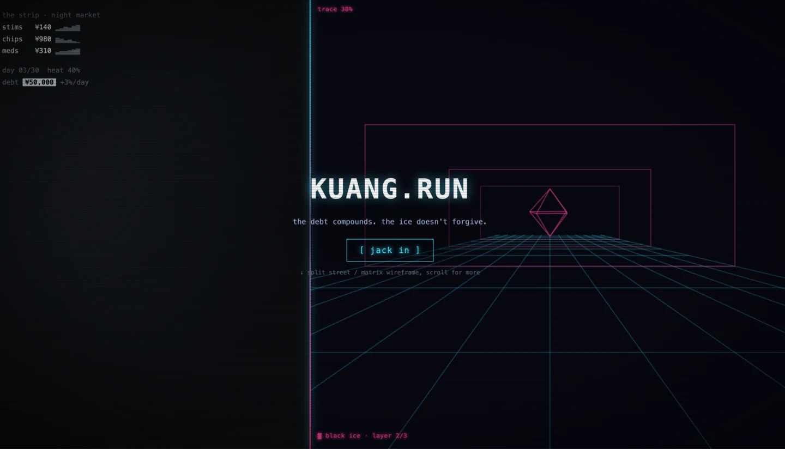
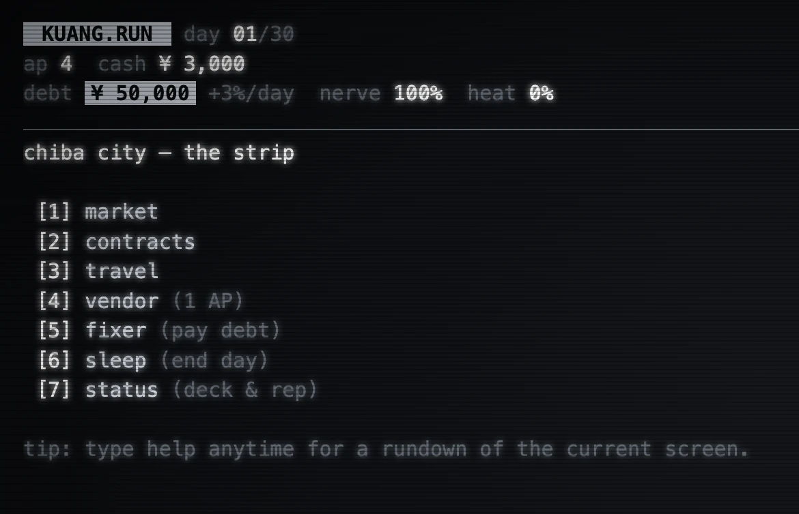
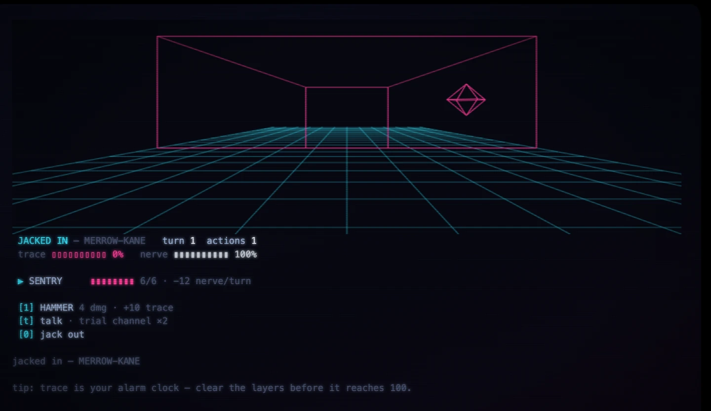

# KUANG.RUN: A Deterministic Text-Mode Economy Game in One HTML File



You owe the wrong people ¥50,000. The debt compounds at 3% a day. You have thirty days, four action points per day, and ¥3,000 to start with.

Trade the districts, run the ice, pay the debt — or find another way out.

## What It Is

A text-mode economy game in the browser, in the register of the old *Drug Wars* / *Taipan!* trading loop, set in a sprawl that owes everything to Gibson. Two interlocking systems:



**The street.** Eight goods across three districts, prices on a mean-reverting random walk, one market event a day. Some goods are hot — selling them adds heat, and traveling with hot cargo risks a customs raid. There are two balances: clean `credits` and `dirty` yen from hot sales and contract payouts. Spending drains dirty first, and **the debt accepts clean credits only**, so laundering (at a 15% cut, one district only) is a required part of any winning line.

**The matrix.** Hacking contracts posted on district boards, resolved in a turn-based mini-game against a stack of ICE. Two clocks run against you: `trace` climbing to 100 dumps you out; `nerve` reaching 0 is a flatline and the run of the game is over. Clear every layer and the payout is dirty yen, heat, and reputation.

Five endings, with a precedence order: flatline, transcendence, leashed, clean exit, collected.

## The Constraint: One File

The whole game builds to a single self-contained `dist/index.html`. No install, no accounts, no backend for the game itself. That constraint drove the architecture more than any design document did.

```text
engine/   pure game logic — never touches document, window, or localStorage
data/     every content and balance table as plain data
ui/       terminal.js (thin renderer + input) and theme.css — the only DOM
worker/   the one backend, deployed separately (optional LLM layer)
```

The engine is unit-testable without a DOM because storage is *injected*: `save(state, storage)` and `load(storage)` take the storage object as a parameter. There are no tests for `ui/` by design — it's a thin renderer over an engine that is tested hard.

All balance numbers live in `data/`. You tune the game by editing tables, never engine logic. Plain JavaScript, zero runtime dependencies; the only deps are Vite, Vitest, and the single-file plugin.

## Determinism Is the Load-Bearing Wall

Every random number in the game flows through one seeded PRNG (mulberry32) whose position is **persisted in the game state**. Every mutating engine call follows the same lifecycle:

```js
const rng = rngOf(state);   // resume the stream where it stopped
// ... use it ...
commitRng(state, rng);      // exactly once
```

`Math.random()` is never called. A test asserts that `newGame(7)` deep-equals `newGame(7)`.

This buys three things at once. Runs are shareable as a seed — same seed, same sprawl. Save/load round-trips mid-game without divergence. And **save-scumming doesn't work**: reloading a save replays the same next roll, so you can't reroll a raid or an ice response by refreshing the page.

Two related invariants make that hold in practice. `newGame(seed)` in `engine/rules.js` is the single source of truth for the state shape, so a field added later gets a default instead of `undefined`. And `load()` merges the save *over* those defaults, which means saves written by older builds keep loading.

A finished game clears its save. There is no going back to look at the ending again.

## Two Visual Worlds

The street is silver monochrome — Gibson's "sky the color of television, tuned to a dead channel." The matrix is cyan for the player, magenta for ICE and trace, drawn as 1984-vintage vector wireframe. Crossing between them triggers a one-shot static flash.

One invariant on the palette: the nerve bar renders silver even inside the matrix. Meat doesn't jack in.

Both themes respect `prefers-reduced-motion`.

## The Oracle: Talking Your Way Past the Ice



The optional layer is the most interesting engineering problem in the project. Some ICE has ears.

The bottom of that screen is the whole design in four lines. `trace` and `nerve` are the two clocks. `HAMMER` costs 10 trace for 4 damage, so brute force is a wager against your own alarm clock. `jack out` is always available and always pays partial. And `[t] talk` — the fifth action.

Each ICE type carries a `disposition`. **Chatty** ice (sentry, tracer) will open a channel. **Deaf** ice (barrier) has no ears and refuses outright. **Hostile** ice (black ice) never listens — it flags the intrusion and spikes your trace by 25 instead.

Talk is a fifth action in an ice-run, one attempt per layer, and it goes to a language model playing the ice in character:

```text
you are tracer ice guarding a corp in gibson's matrix. a hacker on the other
side of the connection just spoke one line to you. decide if it talks you into
standing down. respond ONLY with json:
  {"verdict":"pass|fail|hostile","reply":"<one line back, max 25 words>"}

"pass" only if the line is genuinely clever, in-fiction, and would fool your
protocol. "hostile" if they insult, threaten, or clumsily probe you.
otherwise "fail". be hard to convince: most attempts should fail.
```

Sentry ice is literal-minded and respects authorization codes. Tracer ice is curious and talkative, and flattery sometimes works on it. All of that voice lives server-side, out of the bundle.

### Keeping the engine pure anyway

The engine never calls the network. `engine/talk.js` takes the verdict as **external input — the same category of thing as a player command** — and applies it: pass zeroes the layer, fail leaves it standing, hostile spikes trace. It takes no rng of its own. So the engine stays deterministic and fully testable without a network, and a model in the loop doesn't compromise seeded replay.

Opening a channel marks the layer and spends the attempt *immediately*, and the autosave after that action persists it. Reload mid-conversation and you forfeit the attempt rather than getting it back. That's what forecloses verdict save-scumming.

`ui/oracle.js` is the only networked file in the project: every call resolves to JSON or `null`, never blocks the game, gives up for the session after two consecutive failures, and can be killed outright with a `?nollm` query flag.

### No pay-to-win, and a proof of it

Two free trial channels are granted per playthrough, saved with the game state. Beyond that, talk needs a linked token.

The claim that this isn't pay-to-win has an actual proof: the balance bot (below) never talks, and the balance numbers are calibrated from its runs. A mechanic invisible to the harness cannot be load-bearing in the economy. The oracle is a teaser and a flourish, not a lever.

## Balance as a Test Suite

`tools/simulate.js` runs a deterministic greedy trader bot against the real engine — not a model of it. The bot does pure risk-adjusted EV maximization over every good and destination, prices heat as a liability at the bribe rate, reserves an onward ticket before any hot haul so it can't be ruined, resolves crossroads with the safe option, launders where it can, and pays the debt late and in full.

`npm run tune` prints the distribution over N seeds. `tests/balance.test.js` locks the invariants over 100 seeds:

```text
zero dead market days
median daily net between 8k and 60k
debt clearance rate ≥ threshold
≥5 distinct dominant routes across seeds
hot-haul share between 0.2 and 0.8
every good carries >1.5% of hauls
```

The route-diversity and per-good invariants are the ones that earn their keep: they catch a dominant strategy before a player finds it, and they fail loudly when a balance edit quietly makes one good worthless.

Thresholds recalibrate only by a documented rule — measured minus 5, comment updated, change reported explicitly. Never silently. Tune before and after.

There's a second diversity trick in the data layer: at `newGame`, each good's district bias values are **permuted across districts by the game rng**. The authored spreads are preserved, but *which district is cheap* changes per seed. So route knowledge doesn't transfer between runs, while the market screen's cheap/dear flags (computed against the good's global base) stay truthful.

## The Backend, and Getting Paid Without an SDK

One Cloudflare Worker handles two concerns: the LLM oracle endpoints, and paid fulfillment.

**Stripe with no SDK.** The webhook verifies Stripe's signature with WebCrypto directly. Then it mints a token, emails it via Resend, and records the sale. The interesting part is that `mintToken` is a **deterministic HMAC over persisted claims** — so a Stripe retry re-derives the identical token instead of issuing a second one, and the token itself is never stored anywhere. Idempotency is three KV keys per event: minted, delivered, and a permanent sale record.

**Hardening the free trial.** The trial path is the only unauthenticated endpoint, which makes it the only place an attacker can spend the project's model budget. It's gated to the game's own origins, capped per-IP *and* by a global daily circuit breaker (per-IP alone loses to IP rotation), and — unlike the authenticated path — it **fails closed** when KV is unavailable. A separate global counter caps total model calls per day across everyone. Worst case, abuse burns a bounded cheap-model budget; it can never reach a key, since every secret is server-side worker env, absent from both the game bundle and the committed config.

Worker discipline throughout: never throw unhandled, JSON responses only, and never return 4xx for an event type you're choosing to ignore.

## Tech Stack

```text
Game:
  - plain JavaScript, zero runtime dependencies
  - Vite + vite-plugin-singlefile → one dist/index.html
  - Vitest (engine + balance harness)
  - Cloudflare Pages

Backend (separate deploy):
  - Cloudflare Worker + KV
  - Anthropic API (oracle: epitaph, chatter, ice-talk)
  - Stripe webhook via WebCrypto — no SDK
  - Resend (token delivery), Cloudflare Email Routing (inbound)

Promo:
  - Remotion (the trailer)
```

## A Note on the Fiction

The debt chain, the ICE, the black ice that wakes when your trace climbs past 50, the construct that narrates your epilogue — all of it is a tribute to the cyberpunk genre and to *Neuromancer* in particular. Not affiliated with or endorsed by William Gibson or his publishers.

## Status

The landing page is live at [kuang.run](https://kuang.run). Jack-in opens at release — the game is complete and balance-locked, with the launch gate still closed.

Source is not public: proprietary, © 2026.
