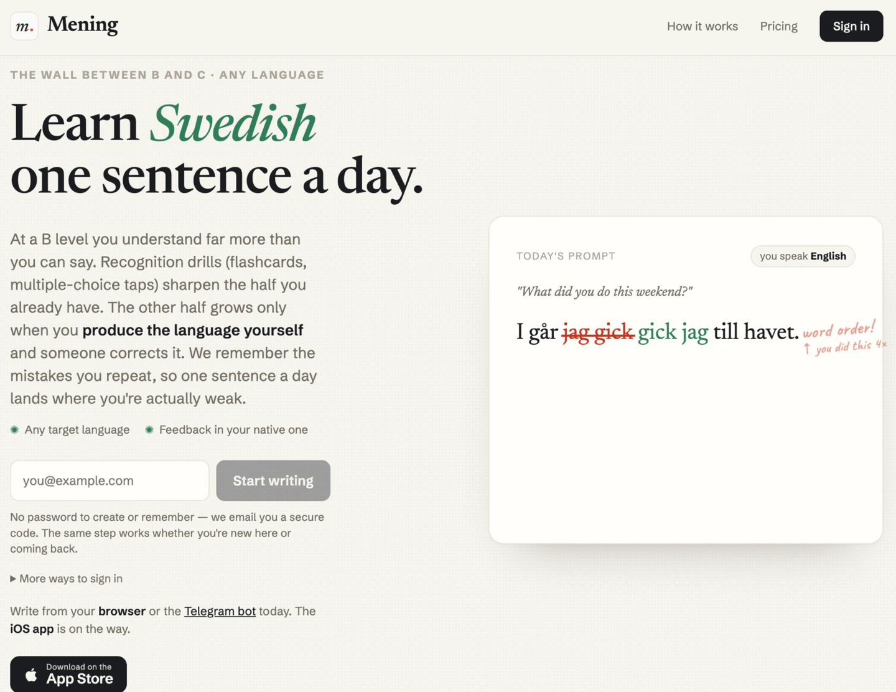
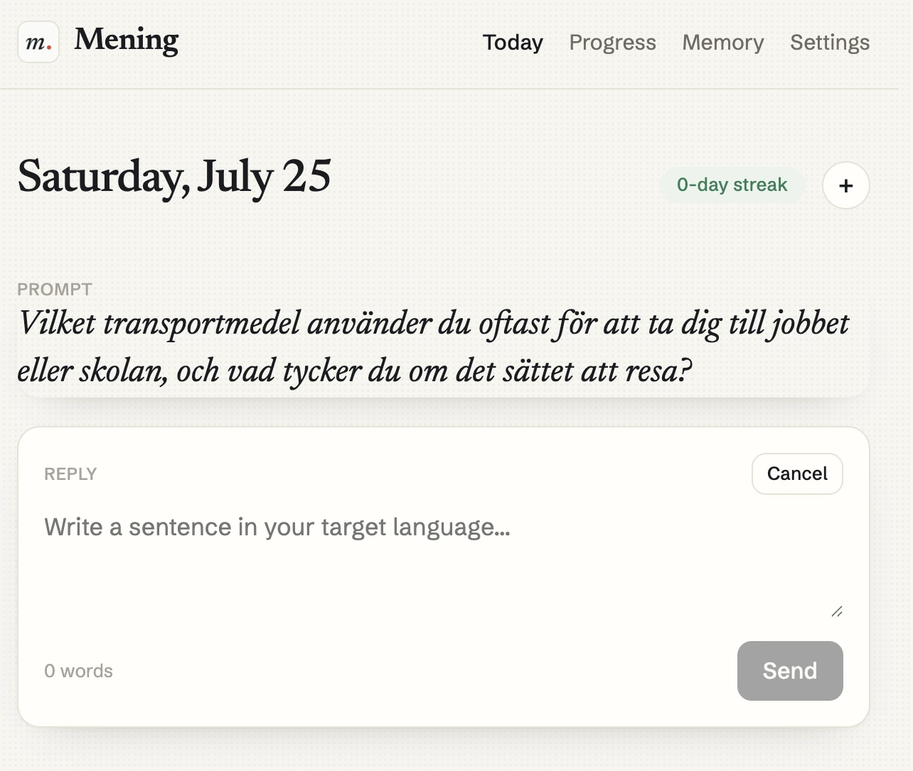
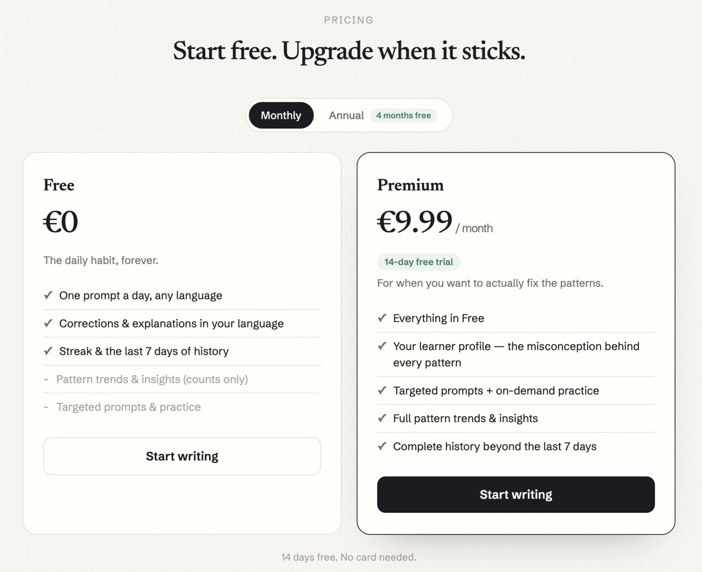

# Mening: The App That Remembers Which Mistakes You Repeat



## The Problem

There is a specific wall in language learning that no app addresses well. You reach the point where you understand almost everything you read and hear, you can hold a conversation, and your writing is *comprehensible* — and then you stop moving. B to C. The remaining gap isn't vocabulary and it isn't grammar you've never met. It's a small set of errors you make over and over, for years, because nothing in your day ever names them.

A grammar checker fixes the sentence in front of it and forgets. A tutor remembers, which is why tutors work — and why they cost €40 an hour. Duolingo asks you to recognize the right answer among four; recognition is not the skill that's stuck.

Mening picks the narrow slice: **daily production, and a memory of your specific recurring errors.**

## What It Does



One prompt a day in your target language. You write at least one sentence. A model corrects it, explains each edit in the language *you* read comfortably, and — the part that matters — every error is filed as a **pattern**: a `category` + `tag` pair with a first-seen date, a last-seen date, and a running occurrence count.

After a few weeks the Memory screen stops being a list of corrections and becomes a diagnosis:

```text
active patterns

  8×  en/ett gender & definiteness    morphology   · 2d ago  · rising
  5×  tense with time markers         syntax       · today   · steady
  3×  verb-second word order          syntax       · 9d ago  · down 70%
  ✓   sj-sound spelling               orthography  · resolved
```

Twenty-two target languages, any explanation language. The streak counts on **submission**, not on being correct — the habit is the product's only real dependency.

## The Differentiator Is the Memory, Not the Correction

A single correction is a commodity. What separates Mening is a three-level data model:

```text
error_patterns      (user + category + tag, UNIQUE, first_seen / last_seen)
  └─ error_occurrences   (the snippet + explanation, per submission)
       └─ practice_audits     (did a targeted prompt get used correctly?)
```

Error categories are a **closed set of six** — morphology, syntax, lexis, orthography, function words, register — CHECK-constrained in the schema and validated again at the LLM boundary. Language-specific detail lives in free-form tags *inside* a category, so the same six buckets work for Swedish and Chinese without a per-language taxonomy.

Every correction call is passed the user's currently active tags. Without that, the model invents a fresh synonym for an error it has already named — `spelling` one day, `spelling_error` the next — and the occurrence counts fragment into noise. Anti-tag-drift is an invariant, not an optimization.

On top of the pattern machinery sits the premium layer: a **misconception** line per pattern ("you treat connectors as interchangeable markers of logical link without distinguishing direction") and a cross-pattern **learner profile** — a short narrative of what the app has noticed about your writing, regenerated every fourteenth submission.

That layer was validated before it was built. The prompts were run over a real learner's corpus of 13 patterns and 81 occurrences, holding back that learner's own hand-written notes as a blind benchmark. The model independently rediscovered the two hardest-won insights in those notes: a preposition used as a universal fallback whenever the correct one is uncertain, and post-pause regression — knowledge held in working memory rather than consolidated as a reflex. That result is what justified the price, and what decided which model tier the feature runs on.

## Two Model Tiers, and Why

The single most consequential architectural decision is that **describing an error and abstracting from it are different jobs for different models.**

```text
Correct           → claude-haiku-4-5   @ temperature 0.2
GeneratePrompt    → claude-sonnet-4-6  @ temperature 1.0
SynthesizeRule    → claude-sonnet-4-6
```

Haiku handles the per-submission correction: it runs on every submission, so it sets the cost floor of the whole product. It is genuinely good at *this sentence has a wrong article, here is the right one*.

Anything written from scratch in the target language, or any statement about the learner's mental model, goes to the stronger tier. Haiku fabricates rule cards and over-generalizes when asked to name an underlying misconception. It also emits ungrammatical prompts — it once produced `drycker` where it meant `dricker`, which is a mistake shipped to a learner as instruction. Prompt generation deliberately keeps temperature 1.0 for variety; corrections run at 0.2, because at the API default of 1.0 the model intermittently ignored hard rules.

## Where a Prompt Cannot Fix a Cheap Model

Two failure modes taught the sharpest lesson in the codebase.

**The explanation-language drift.** A real user learning Finnish with a Russian interface intermittently received explanations *in Finnish*. At temperature 1.0, when the payload was dominated by target-language text, haiku would quietly drop the abstract instruction to explain in the UI language. Prompt days drifted; free-writing days never did. Two fixes: temperature 0.2, and restating the rule with concrete language names — "MUST be written in Russian, never in Finnish" — instead of the abstraction "the UI language."

**The dead prompt addons.** Per-language prompt addons are keyed by ISO code. Production was passing the *English name* of the language into the same field. The lookup never matched, so for months the addons were dead code in production — while the golden eval passed ISO codes and therefore exercised a different system prompt than the live app. A test suite that constructs its own request shape can be green and still be testing nothing. The eval now builds the exact production request.

The same class of bug turned up a second time in the second-opinion path, with raw codes and no fallback.

**And then the rules a model simply won't follow.** Four live iterations of prompt wording — including an absolute, unambiguous rule — failed to stop haiku inserting the Chinese aspect particle 了 as a "correction." So the boundary parser drops those edits instead. Same for no-op edits where the "wrong" and "correct" strings are identical.

That produced a working escalation ladder for cheap models:

```text
judgment rule → concrete names / few-shot → late placement in the prompt
             → absolute rule → give up and enforce it in the parser
```

Trust the parser, not the prompt. Prompt addons sit **late** in the system prompt, because recency is the only leverage that reliably beats a strong training prior.

The whole set is gated by a live evaluation corpus of 30 cases against the real API. A subagent proxy on the same model complies where the bare API call does not, so only the live run counts as a pass.

## Architecture

A Go monolith on one machine, with four independent thin clients over the same REST surface.

```text
main.go + config.go   wiring; config from env, fails fast on missing secrets
store/                SQLite via modernc.org/sqlite (CGO-free)
                      append-only migrations, PRAGMA user_version, one tx each
llm/                  provider-agnostic boundary: Corrector interface,
                      JSON parse + category validation + edit guards,
                      per-language prompt addons keyed by ISO code
                      golden/  live eval corpus, gated behind an env flag
core/service.go       business logic shared by every client
api/                  REST at /api/v1 — multi-identity auth, today,
                      submissions, history, trends, patterns, billing
bot/                  telegram: hand-rolled client (no libs), webhook, onboarding FSM
worker/               per-minute reminder tick on per-user wall-clock;
                      5-minute retry tick for failed corrections
push/                 web push (VAPID), no-op when keys are unset
web/                  Lit + TS + Vite SPA, embedded into the binary via embed.FS
ios/                  SwiftUI thin client, xcodegen project
android/              Kotlin + Jetpack Compose, MVVM
```

### The invariant that matters most

**The submission is persisted before the LLM is called.** The streak counts on submission. If the model call fails, the user gets a fallback reply, the row stays `pending`, and a retry worker picks it up within five minutes and delivers the correction when it lands. User text is never lost to a provider outage, and a bad minute at the API never breaks a 200-day streak.

Retries cap at five attempts. Past that the row would sit `pending` forever showing "your correction is on its way" — a message that has become a lie. Rather than add a `failed` status (the column is CHECK-constrained; a new value means rebuilding a table with foreign-key children), the flag is **derived at read time** from status plus attempt count. Zero migration, and it retroactively un-sticks rows that were already stuck in production.

Streaks are computed from the submission's local date, never stored.

## Tech Stack

```text
Backend:
  - Go (single binary, single Fly.io machine in arn)
  - SQLite via modernc.org/sqlite — no CGO
  - Litestream → Tigris object storage (continuous replication)
  - Anthropic API: claude-haiku-4-5 (correct) + claude-sonnet-4-6 (synthesize)
  - Stripe (billing), Resend (email magic-link), webpush-go (reminders)

Clients:
  - Telegram bot — hand-rolled HTTP client, no library
  - Web — Lit 3 + TypeScript + Vite, embedded via embed.FS
  - iOS — SwiftUI, xcodegen
  - Android — Kotlin + Jetpack Compose, MVVM + StateFlow

Auth:
  - passwordless by design: email magic-link, Telegram, Sign in with Apple
  - one account, many identities, mergeable in either direction
```

No CGO means the whole thing cross-compiles and ships as one static binary with the web SPA inside it. One machine, always on, because the reminder worker has to tick.

### Design detail: passwordless, and defending the decision

A user complained that registration "feels too simple, unfamiliar." The instinct is to add a password. The actual problem was perception, not mechanism, and the fix was one line of reassurance under the email field — *no password; we email you a secure code, and the same step works whether you're new or coming back.* Adding a password would have solved the complaint by adding a credential to leak.

Linking accounts across surfaces was a real bug, though: a user who signed up on the web and then opened the bot got a fresh onboarding and an orphaned second account. Now the client mints a short-lived token and hands it to Telegram as a deep-link payload, so `/start <code>` merges the two identities into whichever account carries the history — and moves the sessions across, so the user stays signed in on both.

## Where It Runs

Live on the web at [mening.app](https://mening.app) and as the Telegram bot **@MeningAppBot**. The iOS and Android clients are built and merged but not yet in the stores — both are gated on paid developer accounts, not on code.



The free tier is the daily habit — a prompt, a correction, an explanation in your language, the streak, and the last seven days. Premium is the memory layer: the learner profile, the misconception behind each pattern, targeted practice, and the full history. €9.99 a month or €79 a year, with a 14-day trial and no card up front.

The split follows the cost structure honestly. Corrections run on the cheap tier and are free forever, because they're what builds the habit. Everything on the expensive tier — the sonnet-grade abstraction over your accumulated errors — sits behind the paywall.

## Links

- App: [mening.app](https://mening.app)
- Agent interface: [Mening Skill](/projects/mening-skill/) — the same account, driven from OpenClaw or Hermes
- Background reading: [Ship a skill or be invisible to the agent](/posts/agent-or-invisible/) · [Two-stage generation, and who is waiting for the answer](/posts/two-stage-generation-and-transport/)
