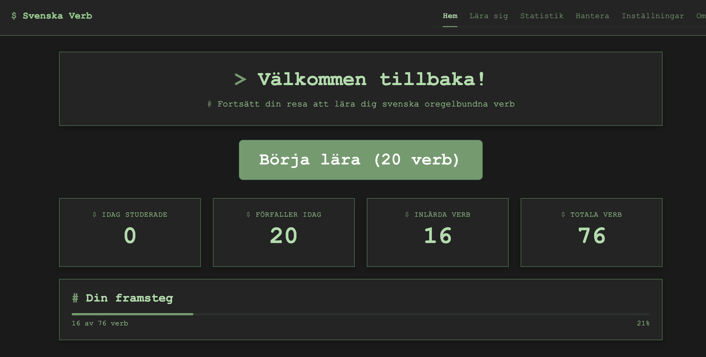
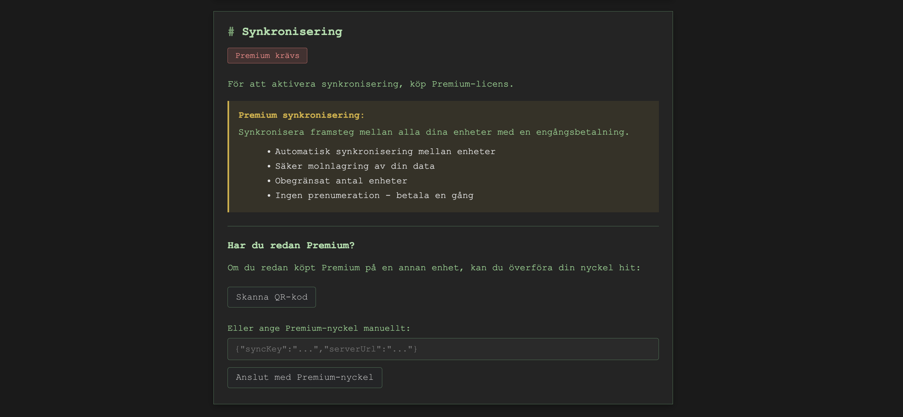
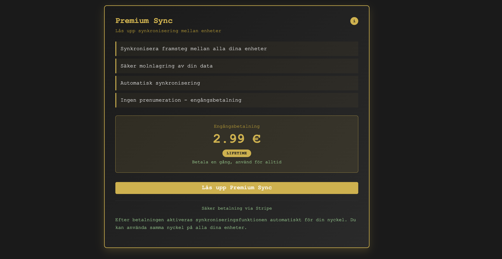

## 1. Overview

[Svenska Verb](https://svea.fly.dev/)

This app is a focused, offline‑capable Swedish verb learning tool. It combines a lean Node.js backend (synchronization + licensing + snapshot generation) with a Vite/TypeScript frontend built entirely from custom Web Components—no heavyweight SPA framework. Data flows through a snapshot/verification pipeline backed by SQLite for determinism and easy recovery.

The goal: minimize moving parts while keeping future extensibility (custom verbs, SRS scheduling, multi‑language overlays) straightforward.

<div style="display:flex;flex-direction:column;gap:1.25rem;align-items:flex-start;">
  
</div>

## 2. Architecture at a Glance

```
Front-End (Vite + TS + Web Components)
   ├─ State & Caching: src/services/storage.ts
   ├─ Migration Logic: src/services/migration.ts
   ├─ Sync Client:     src/services/sync.ts
   ├─ Licensing:       src/services/license.ts
   └─ UI Components:   src/components/*.ts
            │
            ▼
Node.js Sync / API Server
   ├─ server.ts (HTTP endpoints)
   ├─ db.ts (SQLite access)
   ├─ snapshots.db (+ WAL/SHM)
   └─ Data Generation / Repair Scripts (scripts/*.js|ts)
            │
            ▼
Source Datasets
   ├─ data/verbs.json
   └─ Generated examples / translations
```

Core Principles:

- Snapshot-based sync instead of granular mutation diffs.
- TypeScript shared model definitions (`src/types/index.ts`).
- Deterministic rebuilding for recovery (repair guides documented).
- Strict separation between static canonical data vs. user-specific future overlays.

## 3. Technology Choices & Rationale

| Area           | Choice                  | Rationale                                                           |
| -------------- | ----------------------- | ------------------------------------------------------------------- |
| Runtime        | Node.js                 | Ubiquitous ecosystem, stability, broad library compatibility.       |
| Build          | Vite                    | Fast dev reloads, ES modules, minimal config overhead.              |
| UI Layer       | Native Web Components   | Small footprint, progressive enhancement, no framework lock‑in.     |
| Persistence    | SQLite (file-based)     | Immutable snapshot generation, simple backups, zero external infra. |
| Language       | TypeScript              | Shared contracts and safer refactors across server/client.          |
| Data Transport | Full snapshots + hashes | Simplifies sync logic and corruption detection.                     |

(Previously an early Bun prototype existed; migration to Node.js standardized tooling and resolved ecosystem edge cases.)

## 4. Data Model & Snapshot Strategy

The server periodically (or on demand) materializes a snapshot consisting of:

- Verbs dataset (normalized structure).
- Examples, translations, and metadata.
- Snapshot header (`version`, `contentHash`, `schemaVersion`, `generatedAt`).

Why full snapshots?

1. Predictable recovery—discard local state if mismatched.
2. Easier integrity checks (single hash instead of complex diff sets).
3. Simplicity for mostly read-heavy data with infrequent structural changes.

Local client workflow (`storage.ts`):

1. Load cached snapshot (if present).
2. Render immediately for fast perceived load.
3. Async sync request: pass `version` + `contentHash`.
4. If mismatch → replace + run migrations → rehydrate views.

## 5. Hashing & Integrity

Hash generation approach (conceptual):

- Normalize object arrays (stable sort + selective projection).
- Serialize with canonical JSON (no extra whitespace).
- Compute SHA-256.
- Store alongside `version`.

Client Verification:

- Compare `contentHash`.
- If mismatch and schema identical → pure data refresh.
- If `schemaVersion` advanced → invoke migration pipeline first.

Edge Defense:

- Partial write detection via hash absence or JSON parse failure.
- Selective key cleanup instead of wholesale storage purge.

## 6. Migration Layer

`migration.ts` applies schema transformations such as:

- Adding new fields with defaults (e.g., introducing frequency bands).
- Renaming keys while preserving user progress (future overlay concept).
- Backfilling translation arrays.

Pattern:

```typescript
type Migration = {
  from: number;
  to: number;
  apply: (snapshot: Snapshot) => Snapshot;
};
```

Executed sequentially until local `schemaVersion === snapshot.schemaVersion`. Migrations are pure: input snapshot → output snapshot, enabling testability and deterministic replays.

Failure Modes Considered:

- Skipped intermediate version (user inactive for multiple releases).
- Corrupted local partially migrated state.
- Oversized diffs if verbose example expansion is introduced.

## 7. Synchronization Protocol (Minimalistic)

<div style="display:flex;flex-direction:column;gap:1.25rem;align-items:flex-start;">
  
</div>

Request:

```
GET /sync?version=<lastVersion>&hash=<contentHash>
```

Server Responses:

- Unchanged: lightweight header-only JSON (`{ unchanged: true, latestVersion }`).
- Changed: full snapshot payload.
- Future (not yet implemented): optional patch set when delta size << snapshot size.

No bidirectional user mutation complexity today (verbs themselves are static). This defers the need for CRDTs or operational transforms until user-generated data arrives.

Upgrade Path:

1. Introduce per-user overlay table (custom verbs, notes).
2. Dual-phase sync: base snapshot + overlay diff merge.
3. Conflict strategy: last-write-wins with audit log fallback.

## 8. Scripts & Data Generation

Scripts under `scripts/` implement idempotent transforms:

Examples:

- Translation augmentation (`add-arabic-translations.js`, etc.).
- Example generation combinator (`generate-all-examples.js`).
- Integrity checks (`check-server-data.ts`).
- License test artifact creation (`create-test-license.ts`).

Common Flow:

1. Load canonical JSON.
2. Map over entries with pure transformation.
3. Emit updated JSON or stage into SQLite tables.
4. Recompute snapshot + increment `version`.

Design Choice: Keep generation logic declarative instead of storing procedural metadata inside the dataset—simpler to audit.

## 9. Licensing & Premium

<div style="display:flex;flex-direction:column;gap:1.25rem;align-items:flex-start;">
  
</div>

`license.ts` handles:

- License shape (plan type, expiry, signature or token).
- Validation (time bound, feature gates).
- Grace windows (e.g., slight clock skew tolerance).
- Test license injection via script for staging.

Client components (`app-premium.ts`, `app-settings.ts`):

- Query license state once at app shell init.
- Expose events so feature components subscribe without global mutable singletons.

Security Considerations:

- Avoid putting raw validation secrets client-side.
- Future: add signed capability tokens per feature cluster.

## 10. Web Components Design

Patterns used:

- Shadow DOM encapsulated styling; global CSS only for design tokens (colors, spacing scale).
- Attribute-driven hydration (lightweight until interaction).
- Custom events for upward communication (e.g., `verb-selected`, `license-updated`).

State Handling:

- Local ephemeral state inside component instance.
- Shared durable state lives in service modules (storage/sync/license).
- Explicit hand-off rather than implicit reactivity—clarity beats magic.

Pros:

- Predictable performance.
- Small dependency surface (easier long-term maintenance).
  Cons:
- Manual orchestration (no virtual DOM diff).
  Mitigations:
- Utility for event bus (simple publish/subscribe).
- Derived caches computed once per snapshot, reused.

## 11. Performance & Offline Flow

Cold Start:

- Immediate render using cached snapshot (no blank screen).
- Async verification for freshness.

Bundle Minimization:

- No framework runtime cost.
- Shared TypeScript types prevent duplicate model parsing logic.

Potential Future Optimizations:

- Snapshot compression (gzip) with hash-of-uncompressed form.
- Structured cloning & IndexedDB if dataset size grows markedly.
- Prefetch heuristic for next example sets.

## 12. Error Handling & Recovery

Supporting docs formalize:

- Detecting hash mismatch vs. schema mismatch vs. structural corruption.
- Regenerating snapshot from source JSON + scripts pipeline.
- WAL cleanup steps if SQLite anomalies arise.

Client Recovery Sequence:

1. Try parse → fail → isolate failing segment.
2. Fetch fresh snapshot.
3. Rebuild derived indices (tense groupings, translation lookup maps).

Telemetry (planned):

- Flag abnormal migration durations.
- Count fallback resets for proactive quality tracking.

## 13. Testing & Verification

Strategy:

- Deterministic snapshot generation: feed stable dataset, assert consistent `contentHash`.
- Migration unit tests: feed synthetic older snapshots, validate transformed shape.
- License boundary tests: off-by-one day expiry, invalid signature, plan downgrade path.

Future Additions:

- Sync contract tests (simulate version skew).
- Property-based generation for edge verb forms.
- Static analysis rule enforcing stable key ordering before hashing.

## 14. Evolution Path

Near-Term Ideas:

- User overlays (custom verbs / notes).
- Spaced Repetition scheduler integrating review timestamps.
- Multi-language UI mode (reuse existing translation substrate).
- Differential sync (patch array vs. full snapshot).
- Lightweight analytics (aggregate study patterns, privacy preserving).

Long-Term:

- Plug-in architecture for new language packs.
- iOS / Android companion apps sharing same sync backend.

## 15. Historical Note (Runtime Migration)

Early iterations used an alternative JavaScript runtime for faster script prototyping. Migration to Node.js consolidated tooling and eliminated peripheral compatibility issues (payment provider SDK quirks, some ESM edge cases). This affirmed the architectural aim: stability > micro-benchmark differences for this domain.

## 16. Closing Thoughts

The application leans on:

- Snapshot determinism for integrity.
- Web Components for lean UI delivery.
- Explicit migration & recovery playbooks for resilience.

By resisting premature complexity (diff protocols, large framework state layers), the codebase stays approachable while leaving clear seams for future capability overlays.

If you’d like a follow-up deep dive (e.g., hash canonicalization strategy or proposed overlay merge algorithm), that can be expanded into a sequel post.
