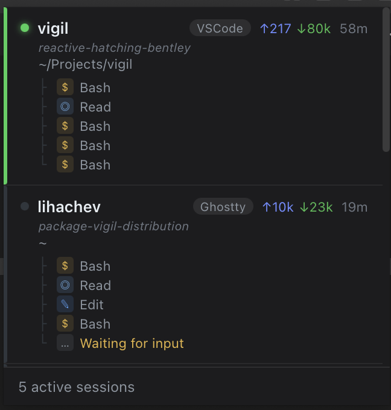

# Vigil: A Menubar App for Claude Code Sessions



## The Problem With Many Sessions

Once you start running Claude Code seriously, you end up with multiple sessions. One fixing a bug in the API, one refactoring the frontend, one writing tests. Each in a different terminal window or editor tab.

The question is always the same: which one needs my attention right now?

You alt-tab between windows trying to remember where Claude was waiting. You switch to a terminal only to find it's been idle for ten minutes. You miss the session that needed a permission confirmation.

Vigil fixes this.

## What It Does

Vigil sits in your macOS menubar and polls Claude Code's local data files every 3 seconds. Click the tray icon to see all running sessions - their current task, token usage, and which editor or terminal they're in. Click any session to bring that window to front instantly.

**Session statuses at a glance:**

- Active - Claude is executing tools right now
- Waiting - Claude finished, needs your input
- Confirm - Claude needs permission to proceed
- Idle - no activity for 5+ minutes

No more alt-tabbing blind. One click shows you everything.

## How It Works

Claude Code writes a lot of local data files. Vigil reads three sources:

```text
~/.claude/sessions/*.json          → live process IDs + working directories
~/.claude/ide/*.lock               → VSCode / Cursor workspace mapping
~/.claude/projects/**/*.jsonl      → actions, tokens, session name, status
```

The `monitor.Manager` merges these into a session list, pushed to the frontend via Wails events every 3 seconds.

Clicking a session calls `switcher.ActivateSession` - which uses AppleScript and macOS Accessibility APIs to raise the exact window in your editor or terminal.

No server, no cloud, no account. Everything local.

## Tech Stack

```text
Backend:
  - Go 1.23
  - Wails v2 (Go + WebView bridge)
  - CGo + Objective-C (native macOS tray)
  - AppleScript + Accessibility API (window switching)

Frontend:
  - Lit (Web Components)
  - TypeScript
```

Wails was the right call here. Go handles all the file watching, process tree traversal, and macOS system calls. The frontend is just display logic - a Lit component rendering whatever the Go backend pushes.

The tray itself is native Objective-C compiled via CGo. Wails doesn't expose a menubar API, so I wrote the status bar item in `tray_darwin.m` with Go callbacks exported via CGo. Small, fast, no dock icon.

## A Few Interesting Problems

**Session identification.** Claude Code creates JSONL files named by session ID, but resumed sessions get a new ID while continuing the same work. Vigil falls back to the newest `.jsonl` in the project directory when the exact filename doesn't match.

**Status detection.** There's no explicit "status" field in Claude's data files. Vigil infers it: if the JSONL was modified more than 5 minutes ago - idle. If the last assistant message is text only - waiting. If there's a pending tool_use - active.

**Window focus.** macOS is picky about apps stealing focus. Using `NSApp activate` would pull focus away from whatever the user was typing. Instead Vigil calls `NSWindow orderFront` directly - the target window comes to front, but the user's current focus stays intact.

## Install

Download [Vigil.dmg](https://github.com/avlihachev/vigil/releases/latest/download/Vigil.dmg), drag to Applications, grant Accessibility access on first launch.

Source on [GitHub](https://github.com/avlihachev/vigil). MIT license.
